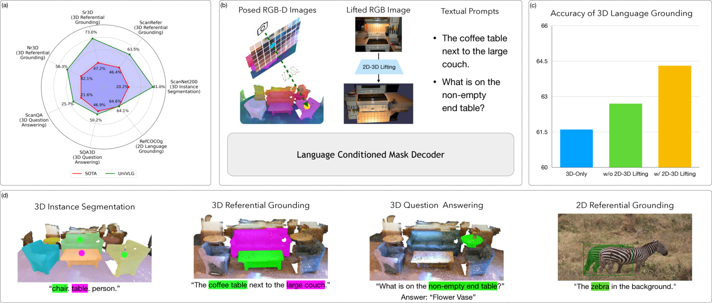

<div align="center">
<br>
<h3>Unifying 2D and 3D Vision-Language Understanding</h3>



<br>
<br>

[Ayush Jain](https://ayushjain1144.github.io/)<sup>*1,2</sup>&nbsp;
[Alexander Swerdlow](https://aswerdlow.com/)<sup>*1</sup>&nbsp;
[Yuzhou Wang](https://mihirp1998.github.io/)<sup>1</sup>&nbsp;
[Sergio Arnaud](https://scholar.google.com/citations?user=-dCETaQAAAAJ)<sup>2</sup>&nbsp;
[Ada Martin](https://scholar.google.com/citations?user=rb5QHIUAAAAJ)<sup>2</sup>&nbsp;
[Alexander Sax](https://alexsax.github.io/)<sup>2</sup>&nbsp;
[Franziska Meier](https://fmeier.github.io/)<sup>2</sup>&nbsp;
[Katerina Fragkiadaki](https://www.cs.cmu.edu/~katef/)<sup>1</sup>&nbsp;
<br>

<sup>1</sup> Carnegie Mellon University&nbsp;
<sup>2</sup> Meta AI&nbsp;
 
[](https://arxiv.org/abs/2503.10745) [](https://univlg.github.io/) 

## Project Updates

**News**: ```2025/02/25```: We achieved 1st place on the [ScanRefer localization leaderboard](https://kaldir.vc.in.tum.de/scanrefer_benchmark/benchmark_localization)!
  
</div>

## Hugging Face models

The UniVLG checkpoints are available on [Hugging Face](https://huggingface.co/katefgroup/UniVLG/tree/main).

## Getting Started

To install the dependencies, see [docs/INSTALL.md](docs/INSTALL.md).

### Checkpoints

```bash
mkdir ckpts
uvx --from huggingface_hub huggingface-cli download katefgroup/UniVLG --include "univlg.pth" --local-dir ckpts
```

To download the 3D-only model, replace `univlg.pth` with `univlg_3d_only.pth` in the command above. Alternatively, to download all checkpoints, run:

```bash
uvx --from huggingface_hub huggingface-cli download katefgroup/UniVLG --local-dir ckpts
```

### Training and Evaluation

See [docs/RUN.md](docs/RUN.md) for training and evaluation commands.

## Citation
To cite our work, please use the following:
```
@article{jain2025unifying,
  title={Unifying 2D and 3D Vision-Language Understanding},
  author={Jain, Ayush and Swerdlow, Alexander and Wang, Yuzhou and Arnaud, Sergio and Martin, Ada and Sax, Alexander and Meier, Franziska and Fragkiadaki, Katerina},
  journal={arXiv preprint arXiv:2503.10745},
  year={2025}
}
```

## Credits

- [DINOv2](https://github.com/facebookresearch/dinov2)
- [Mask2Former](https://github.com/facebookresearch/Mask2Former)
- [ODIN](https://github.com/ayushjain1144/odin)

## Notice

The majority of UniVLG is licensed under CC-BY-NC, however portions of the project are available under separate license terms: Odin is licensed under the MIT license. Pointcept is licensed under the MIT license.
